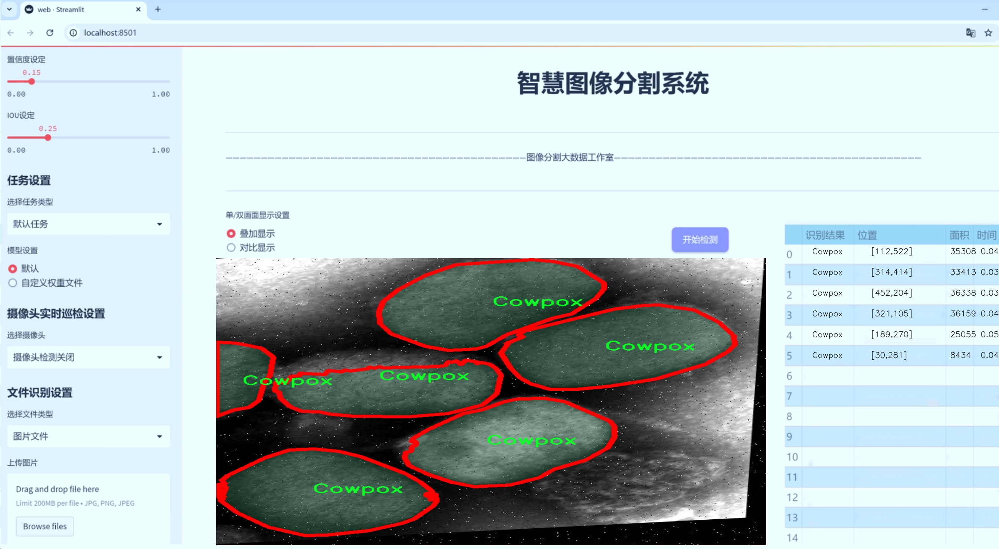
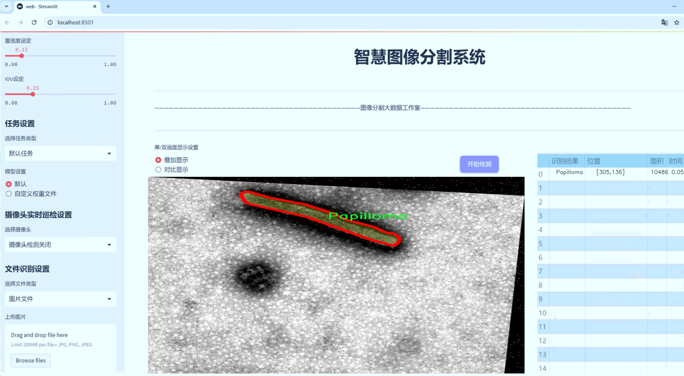
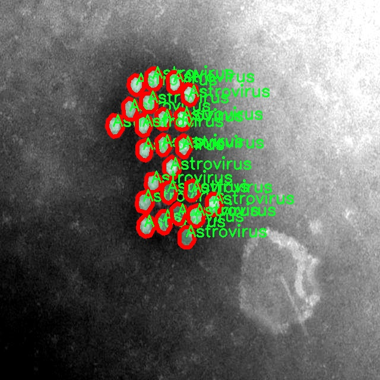
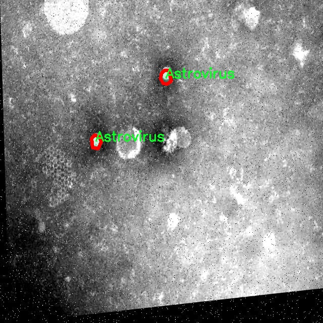
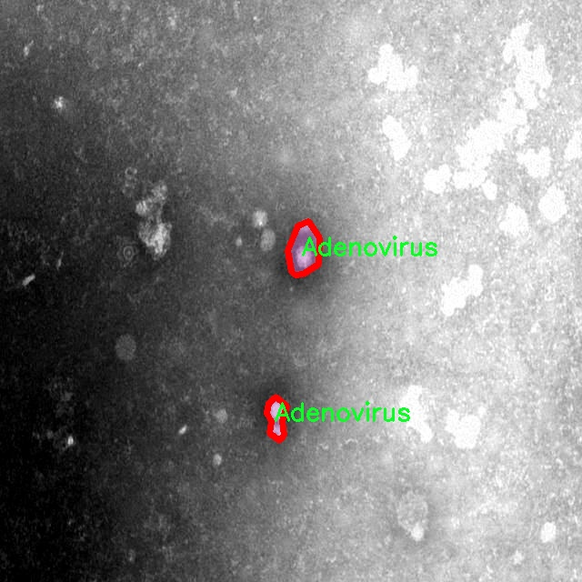
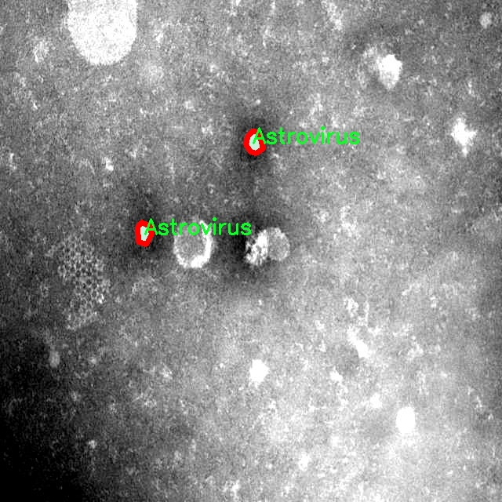
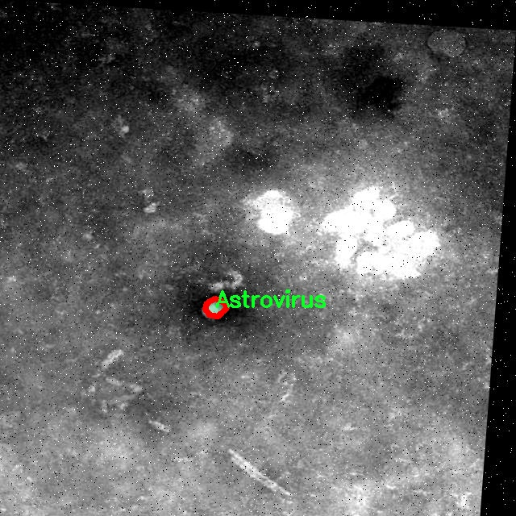

# 病毒病害图像分割系统： yolov8-seg-GFPN

### 1.研究背景与意义

[参考博客](https://gitee.com/YOLOv8_YOLOv11_Segmentation_Studio/projects)

[博客来源](https://kdocs.cn/l/cszuIiCKVNis)

研究背景与意义

随着全球气候变化和人类活动的加剧，病毒性疾病的传播速度和范围日益扩大，给公共卫生和农业生产带来了严重威胁。近年来，诸如新冠病毒、埃博拉病毒和流感病毒等多种病毒性疾病的爆发，突显了快速、准确地识别和分割病毒病害图像的重要性。传统的病毒检测方法通常依赖于实验室检测和临床症状，然而这些方法不仅耗时长，而且对专业技术人员的依赖性强，难以实现快速响应。因此，基于计算机视觉和深度学习技术的图像分割系统逐渐成为研究的热点。

在这一背景下，YOLO（You Only Look Once）系列模型因其在实时目标检测中的优越性能而受到广泛关注。YOLOv8作为该系列的最新版本，具备更高的检测精度和更快的处理速度，适合于处理复杂的病毒病害图像。然而，现有的YOLOv8模型在处理病毒病害图像时仍存在一定的局限性，尤其是在图像分割的精细度和对多类别病毒的识别能力方面。因此，改进YOLOv8以适应病毒病害图像分割的需求显得尤为重要。

本研究旨在基于改进的YOLOv8模型，构建一个高效的病毒病害图像分割系统。我们将利用包含1200张图像和16个类别的病毒病害数据集，这些类别涵盖了从腺病毒到诺如病毒等多种重要病毒。通过对这些图像进行深入分析和处理，我们希望能够提升模型在多类别病毒图像分割中的表现，进而为病毒性疾病的早期检测和预警提供有力支持。

本研究的意义不仅在于技术上的创新，更在于其对公共卫生和农业防疫的实际应用价值。通过实现高效的病毒病害图像分割系统，我们能够为病毒病害的监测和控制提供实时、准确的图像分析工具。这将有助于相关部门及时识别病毒传播风险，制定有效的防控措施，从而降低病毒性疾病对人类健康和农业生产的影响。此外，该系统的成功应用还可能为其他领域的图像分割任务提供借鉴，推动计算机视觉技术在生物医学和生态环境监测等领域的进一步发展。

综上所述，基于改进YOLOv8的病毒病害图像分割系统的研究，不仅具有重要的学术价值，也具备显著的社会意义。通过提升病毒病害的检测和分割能力，我们期待能够为公共卫生安全和农业可持续发展贡献一份力量。

### 2.图片演示






注意：本项目提供完整的训练源码数据集和训练教程,由于此博客编辑较早,暂不提供权重文件（best.pt）,需要按照6.训练教程进行训练后实现上图效果。

### 3.视频演示

[3.1 视频演示](https://www.bilibili.com/video/BV1XXUoYCE9B/)

### 4.数据集信息

##### 4.1 数据集类别数＆类别名

nc: 16
names: ['Adenovirus', 'Astrovirus', 'CCHF', 'Covid19', 'Cowpox', 'Ebola', 'Influenza', 'Lassa', 'Marburg', 'Papilloma', 'Papioma', 'Rift Valley', 'Rotavirus', 'nipah', 'norovirus', 'orf']


##### 4.2 数据集信息简介

数据集信息展示

在本研究中，我们使用了名为“Virus brone Disesase”的数据集，以训练和改进YOLOv8-seg的病毒病害图像分割系统。该数据集专注于多种病毒病害的图像数据，涵盖了广泛的病毒种类，共计包含16个类别。这些类别包括：Adenovirus、Astrovirus、CCHF、Covid19、Cowpox、Ebola、Influenza、Lassa、Marburg、Papilloma、Papioma、Rift Valley、Rotavirus、Nipah、Norovirus和Orf。这些病毒不仅在医学研究中具有重要意义，而且在公共卫生领域也引起了广泛关注。

每个类别的图像数据均经过精心挑选和标注，确保在训练过程中能够提供高质量的输入。这些图像展示了不同病毒感染的症状和表现，涵盖了从细胞层面到整体生物体的多种视角。这种多样性使得模型能够学习到更为复杂的特征，进而提高其在实际应用中的表现。

在数据集的构建过程中，研究团队采取了多种数据增强技术，以扩展数据集的规模和多样性。这些技术包括旋转、缩放、翻转和颜色变换等，旨在提高模型的鲁棒性和泛化能力。通过这种方式，数据集不仅包含了原始图像，还生成了多种变体，使得模型在面对不同条件和环境时，能够更好地进行图像分割。

此外，数据集的标注过程也经过严格的质量控制。每一张图像都由专业的生物医学专家进行标注，确保标注的准确性和一致性。这一过程不仅提高了数据集的可靠性，也为后续的模型训练提供了坚实的基础。通过精确的标注，YOLOv8-seg模型能够有效地识别和分割出不同病毒病害的特征区域，从而实现更为精准的分类和检测。

在模型训练阶段，我们采用了分层抽样的方法，以确保每个类别的数据在训练集和验证集中的比例合理。这种方法有效地避免了类别不平衡问题，使得模型在学习过程中能够充分接触到每一种病毒的特征。这对于提高模型的整体性能至关重要，尤其是在处理复杂的医学图像时，模型的准确性和可靠性直接影响到疾病的诊断和治疗。

总之，“Virus brone Disesase”数据集为本研究提供了丰富的图像数据和标注信息，支持我们在病毒病害图像分割领域的探索与创新。通过利用这一数据集，我们期望能够推动YOLOv8-seg模型在病毒病害检测中的应用，提升其在实际医疗场景中的表现，为公共卫生防控提供更为有效的技术支持。











### 5.项目依赖环境部署教程（零基础手把手教学）

[5.1 环境部署教程链接（零基础手把手教学）](https://www.bilibili.com/video/BV1jG4Ve4E9t/?vd_source=bc9aec86d164b67a7004b996143742dc)


[5.2 安装Python虚拟环境创建和依赖库安装视频教程链接（零基础手把手教学）](https://www.bilibili.com/video/BV1nA4VeYEze/?vd_source=bc9aec86d164b67a7004b996143742dc)

### 6.手把手YOLOV8-seg训练视频教程（零基础手把手教学）

[6.1 手把手YOLOV8-seg训练视频教程（零基础小白有手就能学会）](https://www.bilibili.com/video/BV1cA4VeYETe/?vd_source=bc9aec86d164b67a7004b996143742dc)


按照上面的训练视频教程链接加载项目提供的数据集，运行train.py即可开始训练



     Epoch   gpu_mem       box       obj       cls    labels  img_size
     1/200     0G   0.01576   0.01955  0.007536        22      1280: 100%|██████████| 849/849 [14:42<00:00,  1.04s/it]
               Class     Images     Labels          P          R     mAP@.5 mAP@.5:.95: 100%|██████████| 213/213 [01:14<00:00,  2.87it/s]
                 all       3395      17314      0.994      0.957      0.0957      0.0843

     Epoch   gpu_mem       box       obj       cls    labels  img_size
     2/200     0G   0.01578   0.01923  0.007006        22      1280: 100%|██████████| 849/849 [14:44<00:00,  1.04s/it]
               Class     Images     Labels          P          R     mAP@.5 mAP@.5:.95: 100%|██████████| 213/213 [01:12<00:00,  2.95it/s]
                 all       3395      17314      0.996      0.956      0.0957      0.0845

     Epoch   gpu_mem       box       obj       cls    labels  img_size
     3/200     0G   0.01561    0.0191  0.006895        27      1280: 100%|██████████| 849/849 [10:56<00:00,  1.29it/s]
               Class     Images     Labels          P          R     mAP@.5 mAP@.5:.95: 100%|███████   | 187/213 [00:52<00:00,  4.04it/s]
                 all       3395      17314      0.996      0.957      0.0957      0.0845


### 7.50+种全套YOLOV8-seg创新点加载调参实验视频教程（一键加载写好的改进模型的配置文件）

[7.1 50+种全套YOLOV8-seg创新点加载调参实验视频教程（一键加载写好的改进模型的配置文件）](https://www.bilibili.com/video/BV1Hw4VePEXv/?vd_source=bc9aec86d164b67a7004b996143742dc)

### YOLOV8-seg算法简介

原始YOLOv8-seg算法原理

YOLOv8-seg算法是目标检测领域中的一项重要进展，旨在通过更高效的特征提取和处理方式来提升目标检测的准确性和速度。该算法的设计理念源于YOLO系列模型的成功经验，结合了深度学习的最新技术，尤其是在图像分割和特征融合方面的创新。YOLOv8-seg的架构主要由三个部分组成：Backbone、Neck和Head，每个部分在整个模型中发挥着至关重要的作用。

在Backbone部分，YOLOv8-seg采用了一系列卷积和反卷积层来提取输入图像的特征。为了提高模型的性能和减小网络的复杂度，Backbone部分引入了残差连接和瓶颈结构。这种设计不仅有效地减少了计算量，还增强了特征的表达能力。具体而言，Backbone由5个CBS模块、4个C2f模块和1个快速空间金字塔池化（SPPF）模块组成。CBS模块通过标准卷积操作和批归一化，确保了特征提取的稳定性和有效性。而C2f模块则借鉴了YOLOv7中的E-ELAN结构，通过跨层分支连接来增强模型的梯度流，进一步改善了特征的提取效果。SPPF模块则通过多尺度池化，提升了网络对不同尺度目标的适应能力，使得模型在处理复杂场景时表现得更加出色。

接下来是Neck部分，YOLOv8-seg通过多尺度特征融合技术，将来自Backbone不同阶段的特征图进行有效融合。这一过程对于捕捉不同尺度目标的信息至关重要，尤其是在复杂的图像场景中，目标的大小和形状可能会有很大的变化。Neck部分通常采用特征金字塔网络（FPN）和路径聚合网络（PAN）相结合的方式，以便更好地整合多层次的特征信息。通过这种方式，YOLOv8-seg能够在不同尺度下有效地检测目标，提高了目标检测的性能和鲁棒性。

最后，Head部分负责最终的目标检测和分类任务。YOLOv8-seg设有多个检测头，专门用于在不同尺寸的信息下检测目标。每个检测头包含一系列卷积层和反卷积层，负责生成最终的检测结果。在这一阶段，YOLOv8-seg采用了解耦的检测头结构，通过两个并行的卷积分支分别计算回归和类别的损失。这种设计使得模型在处理复杂的目标检测任务时，能够更好地分离目标的定位和分类信息，从而提高了整体的检测精度。

YOLOv8-seg的轻量化设计也是其一大亮点。与之前的YOLO版本相比，YOLOv8在网络结构上进行了优化，特别是在Backbone部分使用了更轻量化的C2F模块，取代了原有的C3模块。这一变化不仅减少了模型的参数量，还提高了特征提取的速度。此外，在特征融合层中，YOLOv8-seg通过减少降采样层和引入BiFPN网络，进一步提升了对不同尺度特征信息的提取效率。BiFPN网络的设计理念是通过高效的双向跨尺度连接和加权特征融合，优化特征的流动和整合，使得模型在处理多尺度目标时表现得更加灵活和高效。

在实际应用中，YOLOv8-seg的输入图像会被缩放到指定的输入尺寸，以满足模型的需求。通过这一系列的结构设计和技术创新，YOLOv8-seg不仅在目标检测任务中展现出了优异的性能，还在图像分割等相关任务中显示出了良好的适应性。随着YOLOv8-seg的不断发展和优化，未来在智能监控、自动驾驶、医疗影像分析等领域的应用前景将更加广阔。

总的来说，YOLOv8-seg算法的原理体现了现代深度学习技术在目标检测领域的前沿发展。通过高效的特征提取、灵活的特征融合和精确的目标检测机制，YOLOv8-seg不仅提升了检测的准确性和速度，还为后续的研究和应用提供了坚实的基础。随着技术的不断进步，YOLOv8-seg有望在更多复杂的视觉任务中发挥重要作用，推动计算机视觉领域的进一步发展。


### 9.系统功能展示（检测对象为举例，实际内容以本项目数据集为准）

图9.1.系统支持检测结果表格显示

  图9.2.系统支持置信度和IOU阈值手动调节

  图9.3.系统支持自定义加载权重文件best.pt(需要你通过步骤5中训练获得)

  图9.4.系统支持摄像头实时识别

  图9.5.系统支持图片识别

  图9.6.系统支持视频识别

  图9.7.系统支持识别结果文件自动保存

  图9.8.系统支持Excel导出检测结果数据


### 10.50+种全套YOLOV8-seg创新点原理讲解（非科班也可以轻松写刊发刊，V11版本正在科研待更新）

#### 10.1 由于篇幅限制，每个创新点的具体原理讲解就不一一展开，具体见下列网址中的创新点对应子项目的技术原理博客网址【Blog】：


[10.1 50+种全套YOLOV8-seg创新点原理讲解链接](https://gitee.com/qunmasj/good)

#### 10.2 部分改进模块原理讲解(完整的改进原理见上图和技术博客链接)【如果此小节的图加载失败可以通过CSDN或者Github搜索该博客的标题访问原始博客，原始博客图片显示正常】

### YOLOv8模型
YOLOv8模型由Ultralytics团队在YOLOv5模型的基础上，吸收了近两年半来经过实际验证的各种改进，于2023年1月提出。与之前的一些YOLO 系列模型想类似，YOLOv8模型也有多种尺寸，下面以YOLOv8n为例，分析 YOLOv8模型的结构和改进点。YOLOv8模型网络结构如
输入图片的部分，由于发现Mosaic数据增强尽管这有助于提升模型的鲁棒性和泛化性，但是，在一定程度上，也会破坏数据的真实分布，使得模型学习到一些不好的信息。所以YOLOv8模型在训练中的最后10个epoch 停止使用Mosaic数据增强。


在网络结构上，首先主干网络的改变不大，主要是将C3模块替换为了C2f模块，该模块的结构在上图中已示出。C2f模块在C3模块的思路基础上，引入了YOLOv7中 ELAN的思路，引入了更多的跳层连接，这有助于该模块获得更丰富的梯度流信息，而且模型的轻量化得到了保证。依然保留了SPPF，效果不变的同时减少了该模块的执行时间。
在颈部网络中，也是将所有的C3模块更改为C2f模块，同时删除了两处上采样之前的卷积连接层。
在头部网络中，采用了YOLOX中使用的解耦头的思路，两条并行的分支分别提取类别和位置特征。由于分类任务更注重于分析特征图中提取到的特征与已输入图片的部分，由于发现 Mosaic数据增强尽管这有助于提升模型的鲁棒性和泛化性，但是，在一定程度上，也会破坏数据的真实分布，使得模型学习到一些不好的信息。所以YOLOv8模型在训练中的最后10个epoch停止使用Mosaic数据增强。
在网络结构上，首先主干网络的改变不大，主要是将C3模块替换为了C2f模块，该模块的结构在上图中已示出。C2f模块在C3模块的思路基础上，引入了YOLOv7中ELAN的思路，引入了更多的跳层连接，这有助于该模块获得更丰富的梯度流信息，而且模型的轻量化得到了保证。依然保留了SPPF，效果不变的同时减少了该模块的执行时间。
在颈部网络中，也是将所有的C3模块更改为C2f模块，同时删除了两处上采样之前的卷积连接层。
在头部网络中，采用了YOLOX中使用的解耦头的思路，两条并行的分支分别提取类别和位置特征。由于分类任务更注重于分析特征图中提取到的特征与已有类别中的哪一种更为相似，而定位任务更关注边界框与真值框的位置关系，并据此对边界框的坐标进行调整。侧重点的不同使得在使用两个检测头时收敛的速度和预测的精度有所提高。而且使用了无锚框结构，直接预测目标的中心，并使用TAL (Task Alignment Learning，任务对齐学习）来区分正负样本，引入了分类分数和IOU的高次幂乘积作为衡量任务对齐程度的指标，认为同时拥有好的定位和分类评价的在分类和定位损失函数中也引入了这项指标。
在模型的检测结果上，YOLOv8模型也取得了较好的成果，图为官方在coCO数据集上 YOLOv8模型的模型尺寸大小和检测的mAP50-95对比图。mAP50-95指的是IOU的值从50%取到95%，步长为5%，然后算在这些IOU下的mAP的均值。图的 a）图展示了YOLOv8在同尺寸下模型中参数没有较大增加的前提下取得了比其他模型更好的精度，图2-17的b)图展示了YOLOv8比其他YOLO系列模型在同尺寸时，推理速度更快且精度没有太大下降。


### 视觉transformer(ViT)简介
视觉transformer(ViT)最近在各种计算机视觉任务中证明了巨大的成功，并受到了相当多的关注。与卷积神经网络(CNNs)相比，ViT具有更强的全局信息捕获能力和远程交互能力，表现出优于CNNs的准确性，特别是在扩大训练数据大小和模型大小时[An image is worth 16x16 words: Transformers for image recognition at scale,Coatnet]。

尽管ViT在低分辨率和高计算领域取得了巨大成功，但在高分辨率和低计算场景下，ViT仍不如cnn。例如，下图(左)比较了COCO数据集上当前基于cnn和基于vit的一级检测器。基于vit的检测器(160G mac)和基于cnn的检测器(6G mac)之间的效率差距超过一个数量级。这阻碍了在边缘设备的实时高分辨率视觉应用程序上部署ViT。


左图:现有的基于vit的一级检测器在实时目标检测方面仍然不如当前基于cnn的一级检测器，需要的计算量多出一个数量级。本文引入了第一个基于vit的实时对象检测器来弥补这一差距。在COCO上，efficientvit的AP比efficientdet高3.8，而mac较低。与YoloX相比，efficient ViT节省67.2%的计算成本，同时提供更高的AP。

中:随着输入分辨率的增加，计算成本呈二次增长，无法有效处理高分辨率的视觉应用。

右图:高分辨率对图像分割很重要。当输入分辨率从1024x2048降低到512x1024时，MobileNetV2的mIoU减少12% (8.5 mIoU)。在不提高分辨率的情况下，只提高模型尺寸是无法缩小性能差距的。

ViT的根本计算瓶颈是softmax注意模块，其计算成本随输入分辨率的增加呈二次增长。例如，如上图(中)所示，随着输入分辨率的增加，vit- small[Pytorch image models. https://github.com/rwightman/ pytorch-image-models]的计算成本迅速显著大于ResNet-152的计算成本。

解决这个问题的一个直接方法是降低输入分辨率。然而，高分辨率的视觉识别在许多现实世界的计算机视觉应用中是必不可少的，如自动驾驶，医疗图像处理等。当输入分辨率降低时，图像中的小物体和精细细节会消失，导致目标检测和语义分割性能显著下降。

上图(右)显示了在cityscape数据集上不同输入分辨率和宽度乘法器下MobileNetV2的性能。例如，将输入分辨率从1024x2048降低到512x1024会使cityscape的性能降低12% (8.5 mIoU)。即使是3.6倍高的mac，只放大模型尺寸而不增加分辨率也无法弥补这一性能损失。

除了降低分辨率外，另一种代表性的方法是限制softmax注意，方法是将其范围限制在固定大小的局部窗口内[Swin transformer,Swin transformer v2]或降低键/值张量的维数[Pyramid vision transformer,Segformer]。然而，它损害了ViT的非局部注意能力，降低了全局接受域(ViT最重要的优点)，使得ViT与大内核cnn的区别更小[A convnet for the 2020s,Scaling up your kernels to 31x31: Revisiting large kernel design in cnns,Lite pose: Efficient architecture design for 2d human pose estimation]。

本文介绍了一个有效的ViT体系结构，以解决这些挑战。发现没有必要坚持softmax注意力。本文建议用线性注意[Transformers are rnns: Fast autoregressive transformers with linear attention]代替softmax注意。

线性注意的关键好处是，它保持了完整的n 2 n^2n 2
 注意映射，就像softmax注意。同时，它利用矩阵乘法的联想特性，避免显式计算完整的注意映射，同时保持相同的功能。因此，它保持了softmax注意力的全局特征提取能力，且计算复杂度仅为线性。线性注意的另一个关键优点是它避免了softmax，这使得它在移动设备上更有效(下图左)。


左图:线性注意比类似mac下的softmax注意快3.3-4.5倍，这是因为去掉了硬件效率不高的softmax功能。延迟是在Qualcomm Snapdragon 855 CPU和TensorFlow-Lite上测量的。本文增加线性注意的头部数量，以确保它具有与softmax注意相似的mac。

中:然而，如果没有softmax注意中使用的非线性注意评分归一化，线性注意无法有效集中其注意分布，削弱了其局部特征提取能力。后文提供了可视化。

右图:本文用深度卷积增强线性注意，以解决线性注意的局限性。深度卷积可以有效地捕捉局部特征，而线性注意可以专注于捕捉全局信息。增强的线性注意在保持线性注意的效率和简单性的同时，表现出在各种视觉任务上的强大表现(图4)。

然而，直接应用线性注意也有缺点。以往的研究表明线性注意和softmax注意之间存在显著的性能差距(下图中间)。


左:高通骁龙855上的精度和延迟权衡。效率vit比效率网快3倍，精度更高。中:ImageNet上softmax注意与线性注意的比较。在相同的计算条件下，本文观察到softmax注意与线性注意之间存在显著的精度差距。而深度卷积增强模型后，线性注意的精度有明显提高。

相比之下，softmax注意的精度变化不大。在相同MAC约束下，增强线性注意比增强软最大注意提高了0.3%的精度。右图:与增强的softmax注意相比，增强的线性注意硬件效率更高，随着分辨率的增加，延迟增长更慢。

深入研究线性注意和softmax注意的详细公式，一个关键的区别是线性注意缺乏非线性注意评分归一化方案。这使得线性注意无法有效地将注意力分布集中在局部模式产生的高注意分数上，从而削弱了其局部特征提取能力。

本文认为这是线性注意的主要限制，使其性能不如softmax注意。本文提出了一个简单而有效的解决方案来解决这一限制，同时保持线性注意在低复杂度和低硬件延迟方面的优势。具体来说，本文建议通过在每个FFN层中插入额外的深度卷积来增强线性注意。因此，本文不需要依赖线性注意进行局部特征提取，避免了线性注意在捕捉局部特征方面的不足，并利用了线性注意在捕捉全局特征方面的优势。

本文广泛评估了efficient vit在低计算预算下对各种视觉任务的有效性，包括COCO对象检测、城市景观语义分割和ImageNet分类。本文想要突出高效的主干设计，所以没有包括任何正交的附加技术(例如，知识蒸馏，神经架构搜索)。尽管如此，在COCO val2017上，efficientvit的AP比efficientdet - d1高2.4倍，同时节省27.9%的计算成本。在cityscape上，efficientvit提供了比SegFormer高2.5个mIoU，同时降低了69.6%的计算成本。在ImageNet上，efficientvit在584M mac上实现了79.7%的top1精度，优于efficientnet - b1的精度，同时节省了16.6%的计算成本。

与现有的以减少参数大小或mac为目标的移动ViT模型[Mobile-former,Mobilevit,NASVit]不同，本文的目标是减少移动设备上的延迟。本文的模型不涉及复杂的依赖或硬件低效操作。因此，本文减少的计算成本可以很容易地转化为移动设备上的延迟减少。

在高通骁龙855 CPU上，efficient vit运行速度比efficientnet快3倍，同时提供更高的ImageNet精度。本文的代码和预训练的模型将在出版后向公众发布。

### Efficient Vision Transformer.
提高ViT的效率对于在资源受限的边缘平台上部署ViT至关重要，如手机、物联网设备等。尽管ViT在高计算区域提供了令人印象深刻的性能，但在针对低计算区域时，它通常不如以前高效的cnn[Efficientnet, mobilenetv3,Once for all: Train one network and specialize it for efficient deployment]。为了缩小差距，MobileViT建议结合CNN和ViT的长处，使用transformer将卷积中的局部处理替换为全局处理。MobileFormer提出了在MobileNet和Transformer之间建立双向桥以实现特征融合的并行化。NASViT提出利用神经架构搜索来搜索高效的ViT架构。

这些模型在ImageNet上提供了极具竞争力的准确性和效率的权衡。然而，它们并不适合高分辨率的视觉任务，因为它们仍然依赖于softmax注意力。


在本节中，本文首先回顾了自然语言处理中的线性注意，并讨论了它的优缺点。接下来，本文介绍了一个简单而有效的解决方案来克服线性注意的局限性。最后，给出了efficient vit的详细架构。

 为可学习投影矩阵。Oi表示矩阵O的第i行。Sim(·，·)为相似度函数。

虽然softmax注意力在视觉和NLP方面非常成功，但它并不是唯一的选择。例如，线性注意提出了如下相似度函数:


其中，φ(·)为核函数。在本工作中，本文选择了ReLU作为内核函数，因为它对硬件来说是友好的。当Sim(Q, K) = φ(Q)φ(K)T时，式(1)可改写为:


线性注意的一个关键优点是，它允许利用矩阵乘法的结合律，在不改变功能的情况下，将计算复杂度从二次型降低到线性型:


除了线性复杂度之外，线性注意的另一个关键优点是它不涉及注意模块中的softmax。Softmax在硬件上效率非常低。避免它可以显著减少延迟。例如，下图(左)显示了softmax注意和线性注意之间的延迟比较。在类似的mac上，线性注意力比移动设备上的softmax注意力要快得多。


#### EfficientViT
Enhancing Linear Attention with Depthwise Convolution

虽然线性注意在计算复杂度和硬件延迟方面优于softmax注意，但线性注意也有局限性。以往的研究[\[Luna: Linear unified nested attention,Random feature attention,Combiner: Full attention transformer with sparse computation cost,cosformer: Rethinking softmax in attention\]](https://afdian.net/item/602b9612927111ee9ec55254001e7c00)表明，在NLP中线性注意和softmax注意之间通常存在显著的性能差距。对于视觉任务，之前的研究[Visual correspondence hallucination,Quadtree attention for vision transformers]也表明线性注意不如softmax注意。在本文的实验中，本文也有类似的观察结果(图中)。


本文对这一假设提出了质疑，认为线性注意的低劣性能主要是由于局部特征提取能力的丧失。如果没有在softmax注意中使用的非线性评分归一化，线性注意很难像softmax注意那样集中其注意分布。下图(中间)提供了这种差异的示例。


在相同的原始注意力得分下，使用softmax比不使用softmax更能集中注意力。因此，线性注意不能有效地聚焦于局部模式产生的高注意分数(下图)，削弱了其局部特征提取能力。


注意图的可视化显示了线性注意的局限性。通过非线性注意归一化，softmax注意可以产生清晰的注意分布，如中间行所示。相比之下，线性注意的分布相对平滑，使得线性注意在捕捉局部细节方面的能力较弱，造成了显著的精度损失。本文通过深度卷积增强线性注意来解决这一限制，并有效提高了准确性。

介绍了一个简单而有效的解决方案来解决这个限制。本文的想法是用卷积增强线性注意，这在局部特征提取中是非常有效的。这样，本文就不需要依赖于线性注意来捕捉局部特征，而可以专注于全局特征提取。具体来说，为了保持线性注意的效率和简单性，本文建议在每个FFN层中插入一个深度卷积，这样计算开销很小，同时极大地提高了线性注意的局部特征提取能力。

#### Building Block

下图(右)展示了增强线性注意的详细架构，它包括一个线性注意层和一个FFN层，在FFN的中间插入深度卷积。


与之前的方法[Swin transformer,Coatnet]不同，本文在efficientvit中没有使用相对位置偏差。相对位置偏差虽然可以改善模型的性能，但它使模型容易受到分辨率变化[Segformer]的影响。多分辨率训练或新分辨率下的测试在检测和分割中很常见。去除相对位置偏差使高效率vit对输入分辨率更加灵活。

与之前低计算CNNs[Mobilenetv2,mobilenetv3]的设计不同，本文为下采样块添加了额外的下采样快捷方式。每个下采样快捷方式由一个平均池和一个1x1卷积组成。在本文的实验中，这些额外的下采样快捷方式可以稳定训练效率，提高性能。

#### Macro Architecture

下图说明了efficientvit的宏观体系结构。它由输入 stem 和4级组成。最近的研究[Coatnet,Levit,Early convolutions help transformers see better]表明在早期阶段使用卷积对ViT更好。本文遵循这个设计，在第三阶段开始使用增强的线性注意。


EfficientViT宏观架构。本文从第三阶段开始使用增强的线性注意。P2、P3和P4形成了一个金字塔特征图，用于检测和分割。P4用于分类。

为了突出高效的主干本身，本文对MBConv和FFN使用相同的扩展比e (e = 4)保持超参数简单，对所有深度卷积使用相同的内核大小k(除了输入stem)，对所有层使用相同的激活函数(hard swish)。

P2、P3和P4表示阶段2、3和4的输出，形成了特征图的金字塔。本文按照惯例将P2、P3和P4送至检测头。本文使用Yolov8进行检测。为了分割，本文融合了P2和P4。融合特征被馈送到一个轻量级头，包括几个卷积层，遵循Fast-SCNN。为了分类，本文将P4输入到轻量级头部，与MobileNetV3相同。


### 11.项目核心源码讲解（再也不用担心看不懂代码逻辑）

#### 11.1 ultralytics\trackers\bot_sort.py

以下是对代码中最核心部分的分析和详细中文注释：

```python
# Ultralytics YOLO 🚀, AGPL-3.0 license

from collections import deque
import numpy as np
from .basetrack import TrackState
from .byte_tracker import BYTETracker, STrack
from .utils import matching
from .utils.gmc import GMC
from .utils.kalman_filter import KalmanFilterXYWH

class BOTrack(STrack):
    """
    BOTrack类是STrack类的扩展版本，添加了对象跟踪功能。
    """
    shared_kalman = KalmanFilterXYWH()  # 所有BOTrack实例共享的卡尔曼滤波器

    def __init__(self, tlwh, score, cls, feat=None, feat_history=50):
        """
        初始化BOTrack实例，设置特征历史、平滑因子和当前特征。
        :param tlwh: 目标的边界框（左上角x, 左上角y, 宽度, 高度）
        :param score: 目标的置信度分数
        :param cls: 目标的类别
        :param feat: 目标的特征向量
        :param feat_history: 特征历史的最大长度
        """
        super().__init__(tlwh, score, cls)  # 调用父类构造函数
        self.smooth_feat = None  # 平滑特征向量
        self.curr_feat = None  # 当前特征向量
        if feat is not None:
            self.update_features(feat)  # 更新特征
        self.features = deque([], maxlen=feat_history)  # 存储特征向量的双端队列
        self.alpha = 0.9  # 指数移动平均的平滑因子

    def update_features(self, feat):
        """
        更新特征向量，并使用指数移动平均进行平滑。
        :param feat: 新的特征向量
        """
        feat /= np.linalg.norm(feat)  # 归一化特征向量
        self.curr_feat = feat  # 更新当前特征
        if self.smooth_feat is None:
            self.smooth_feat = feat  # 如果平滑特征为空，则直接赋值
        else:
            # 使用指数移动平均更新平滑特征
            self.smooth_feat = self.alpha * self.smooth_feat + (1 - self.alpha) * feat
        self.features.append(feat)  # 将新特征添加到队列中
        self.smooth_feat /= np.linalg.norm(self.smooth_feat)  # 归一化平滑特征

    def predict(self):
        """
        使用卡尔曼滤波器预测目标的状态均值和协方差。
        """
        mean_state = self.mean.copy()  # 复制当前均值状态
        if self.state != TrackState.Tracked:
            mean_state[6] = 0  # 如果状态不是跟踪状态，重置速度
            mean_state[7] = 0

        # 预测新的均值和协方差
        self.mean, self.covariance = self.kalman_filter.predict(mean_state, self.covariance)

    @property
    def tlwh(self):
        """
        获取当前目标的位置，格式为边界框（左上角x, 左上角y, 宽度, 高度）。
        :return: 当前目标的边界框
        """
        if self.mean is None:
            return self._tlwh.copy()  # 如果均值为空，返回初始边界框
        ret = self.mean[:4].copy()  # 复制均值的前四个元素
        ret[:2] -= ret[2:] / 2  # 计算左上角坐标
        return ret

    @staticmethod
    def multi_predict(stracks):
        """
        使用共享的卡尔曼滤波器预测多个对象轨迹的均值和协方差。
        :param stracks: 需要预测的轨迹列表
        """
        if len(stracks) <= 0:
            return  # 如果没有轨迹，直接返回
        multi_mean = np.asarray([st.mean.copy() for st in stracks])  # 获取所有轨迹的均值
        multi_covariance = np.asarray([st.covariance for st in stracks])  # 获取所有轨迹的协方差
        for i, st in enumerate(stracks):
            if st.state != TrackState.Tracked:
                multi_mean[i][6] = 0  # 重置速度
                multi_mean[i][7] = 0
        # 使用共享的卡尔曼滤波器进行多目标预测
        multi_mean, multi_covariance = BOTrack.shared_kalman.multi_predict(multi_mean, multi_covariance)
        for i, (mean, cov) in enumerate(zip(multi_mean, multi_covariance)):
            stracks[i].mean = mean  # 更新轨迹均值
            stracks[i].covariance = cov  # 更新轨迹协方差

class BOTSORT(BYTETracker):
    """
    BOTSORT类是BYTETracker类的扩展版本，设计用于YOLOv8的对象跟踪，支持ReID和GMC算法。
    """

    def __init__(self, args, frame_rate=30):
        """
        初始化BOTSORT实例，设置ReID模块和GMC算法。
        :param args: 解析的命令行参数，包含跟踪参数
        :param frame_rate: 帧率
        """
        super().__init__(args, frame_rate)  # 调用父类构造函数
        self.proximity_thresh = args.proximity_thresh  # 空间接近阈值
        self.appearance_thresh = args.appearance_thresh  # 外观相似性阈值
        if args.with_reid:
            self.encoder = None  # 如果未启用ReID，则设置为None
        self.gmc = GMC(method=args.gmc_method)  # 初始化GMC算法

    def get_kalmanfilter(self):
        """
        返回用于对象跟踪的KalmanFilterXYWH实例。
        :return: KalmanFilterXYWH实例
        """
        return KalmanFilterXYWH()

    def init_track(self, dets, scores, cls, img=None):
        """
        使用检测、分数和类别初始化轨迹。
        :param dets: 检测结果
        :param scores: 检测分数
        :param cls: 检测类别
        :param img: 输入图像（可选）
        :return: 初始化的轨迹列表
        """
        if len(dets) == 0:
            return []  # 如果没有检测结果，返回空列表
        if self.args.with_reid and self.encoder is not None:
            features_keep = self.encoder.inference(img, dets)  # 进行ReID特征提取
            return [BOTrack(xyxy, s, c, f) for (xyxy, s, c, f) in zip(dets, scores, cls, features_keep)]  # 返回带特征的轨迹
        else:
            return [BOTrack(xyxy, s, c) for (xyxy, s, c) in zip(dets, scores, cls)]  # 返回不带特征的轨迹

    def get_dists(self, tracks, detections):
        """
        获取轨迹和检测之间的距离，使用IoU和（可选）ReID嵌入。
        :param tracks: 当前轨迹列表
        :param detections: 当前检测结果
        :return: 距离矩阵
        """
        dists = matching.iou_distance(tracks, detections)  # 计算IoU距离
        dists_mask = (dists > self.proximity_thresh)  # 创建距离掩码

        # 计算融合得分
        dists = matching.fuse_score(dists, detections)

        if self.args.with_reid and self.encoder is not None:
            emb_dists = matching.embedding_distance(tracks, detections) / 2.0  # 计算ReID嵌入距离
            emb_dists[emb_dists > self.appearance_thresh] = 1.0  # 超过阈值的距离设为1
            emb_dists[dists_mask] = 1.0  # 应用距离掩码
            dists = np.minimum(dists, emb_dists)  # 取最小值作为最终距离
        return dists

    def multi_predict(self, tracks):
        """
        使用YOLOv8模型预测和跟踪多个对象。
        :param tracks: 当前轨迹列表
        """
        BOTrack.multi_predict(tracks)  # 调用BOTrack的多目标预测方法
```

### 代码核心部分分析：
1. **BOTrack类**：扩展了STrack类，增加了特征更新和卡尔曼滤波器的使用，支持目标跟踪。
2. **特征更新**：通过`update_features`方法实现特征的平滑处理，使用指数移动平均来提高特征的稳定性。
3. **预测功能**：`predict`方法利用卡尔曼滤波器预测目标的状态，更新均值和协方差。
4. **BOTSORT类**：扩展了BYTETracker，支持ReID和GMC算法，提供了初始化轨迹和计算距离的方法，适用于YOLOv8模型的多目标跟踪。

### 使用方法：
- 创建`BOTrack`实例时传入边界框、分数、类别和特征向量。
- 调用`predict`方法进行状态预测。
- 使用`BOTSORT`类进行目标跟踪，调用`init_track`和`multi_predict`方法进行初始化和预测。

这个文件 `bot_sort.py` 是 Ultralytics YOLOv8 项目中的一个模块，主要实现了基于 BoT-SORT 算法的目标跟踪功能。该文件包含两个主要类：`BOTrack` 和 `BOTSORT`，它们分别负责单个目标的跟踪和整体的目标跟踪管理。

`BOTrack` 类是对 `STrack` 类的扩展，增加了对象跟踪的特性。它使用了共享的卡尔曼滤波器来处理目标的状态预测和更新。该类的主要属性包括平滑特征向量、当前特征向量、特征历史记录等。通过 `update_features` 方法，`BOTrack` 可以更新目标的特征向量，并使用指数移动平均法对其进行平滑处理。`predict` 方法则利用卡尔曼滤波器预测目标的状态，包括均值和协方差。`re_activate` 和 `update` 方法用于重新激活和更新目标的跟踪状态。

`BOTSORT` 类是对 `BYTETracker` 类的扩展，设计用于结合 ReID（重识别）和 GMC（全局运动补偿）算法进行目标跟踪。该类的初始化方法中，设置了空间接近性和外观相似性的阈值，并根据参数决定是否启用 ReID 模块。`init_track` 方法用于初始化跟踪，接受检测结果、分数和类别，并根据是否启用 ReID 来处理特征。`get_dists` 方法计算跟踪目标与检测目标之间的距离，结合了 IoU 和 ReID 特征的相似性。`multi_predict` 方法则用于对多个目标进行预测和跟踪。

总体而言，这个文件实现了一个高效的目标跟踪系统，能够处理多个目标的状态预测、特征更新和目标重识别，适用于复杂的视觉跟踪任务。

#### 11.2 ultralytics\nn\extra_modules\ops_dcnv3\test.py

以下是代码中最核心的部分，并附上详细的中文注释：

```python
import torch
from functions.dcnv3_func import DCNv3Function, dcnv3_core_pytorch

# 输入和输出的尺寸参数
H_in, W_in = 8, 8  # 输入图像的高度和宽度
N, M, D = 2, 4, 16  # N: 批量大小, M: 输出通道数, D: 每个通道的深度
Kh, Kw = 3, 3  # 卷积核的高度和宽度
remove_center = False  # 是否移除中心点
P = Kh * Kw - remove_center  # 卷积核的有效点数
offset_scale = 2.0  # 偏移量的缩放因子
pad = 1  # 填充大小
dilation = 1  # 膨胀率
stride = 1  # 步幅
# 计算输出的高度和宽度
H_out = (H_in + 2 * pad - (dilation * (Kh - 1) + 1)) // stride + 1
W_out = (W_in + 2 * pad - (dilation * (Kw - 1) + 1)) // stride + 1

torch.manual_seed(3)  # 设置随机种子以确保可重复性

@torch.no_grad()
def check_forward_equal_with_pytorch_double():
    # 生成随机输入、偏移量和掩码
    input = torch.rand(N, H_in, W_in, M*D).cuda() * 0.01
    offset = torch.rand(N, H_out, W_out, M*P*2).cuda() * 10
    mask = torch.rand(N, H_out, W_out, M, P).cuda() + 1e-5
    mask /= mask.sum(-1, keepdim=True)  # 归一化掩码
    mask = mask.reshape(N, H_out, W_out, M*P)

    # 使用PyTorch的核心函数计算输出
    output_pytorch = dcnv3_core_pytorch(
        input.double(),
        offset.double(),
        mask.double(),
        Kh, Kw, stride, stride, Kh // 2, Kw // 2, dilation, dilation, M, D, offset_scale, remove_center).detach().cpu()

    # 使用自定义的DCNv3函数计算输出
    output_cuda = DCNv3Function.apply(
        input.double(),
        offset.double(),
        mask.double(),
        Kh, Kw, stride, stride, Kh // 2, Kw // 2, dilation, dilation, M, D, offset_scale,
        im2col_step=2, remove_center).detach().cpu()

    # 检查两个输出是否相近
    fwdok = torch.allclose(output_cuda, output_pytorch)
    max_abs_err = (output_cuda - output_pytorch).abs().max()  # 最大绝对误差
    max_rel_err = ((output_cuda - output_pytorch).abs() / output_pytorch.abs()).max()  # 最大相对误差
    print('>>> forward double')
    print(f'* {fwdok} check_forward_equal_with_pytorch_double: max_abs_err {max_abs_err:.2e} max_rel_err {max_rel_err:.2e}')

if __name__ == '__main__':
    check_forward_equal_with_pytorch_double()  # 调用检查函数
```

### 代码说明：
1. **参数设置**：设置输入图像的尺寸、卷积核的尺寸、批量大小等参数，计算输出图像的尺寸。
2. **随机输入生成**：生成随机的输入、偏移量和掩码，并对掩码进行归一化处理。
3. **前向传播检查**：使用 PyTorch 的核心函数和自定义的 DCNv3 函数计算输出，并比较它们的结果，输出最大绝对误差和最大相对误差，以验证实现的正确性。
4. **主函数**：在主函数中调用前向传播检查函数。

这个程序文件是一个用于测试和验证深度学习中动态卷积（DCNv3）实现的脚本。它主要通过与PyTorch的标准实现进行比较，来确保自定义的DCNv3功能的正确性和性能。

首先，文件引入了一些必要的库，包括PyTorch及其相关模块。然后，定义了一些输入参数，如输入图像的高度和宽度（H_in, W_in），批量大小（N），通道数（M），特征维度（D），卷积核的高度和宽度（Kh, Kw）等。这些参数用于后续的卷积操作和输出尺寸的计算。

接下来，程序定义了几个测试函数。`check_forward_equal_with_pytorch_double`和`check_forward_equal_with_pytorch_float`分别用于验证自定义DCNv3实现与PyTorch标准实现的前向传播结果是否一致。它们通过生成随机输入、偏移量和掩码，计算输出，并比较两者的结果，包括最大绝对误差和相对误差。

`check_backward_equal_with_pytorch_double`和`check_backward_equal_with_pytorch_float`则用于验证反向传播的梯度计算是否一致。它们会计算输入、偏移量和掩码的梯度，并比较自定义实现与PyTorch标准实现的梯度是否相近。

最后，`check_time_cost`函数用于测试自定义DCNv3实现的时间性能。它会多次运行卷积操作并记录时间，以评估在不同的im2col步骤下的性能表现。

在主程序部分，依次调用了前向和反向验证函数，并对不同通道数的情况进行了测试。最后，测试了不同的im2col步骤对时间性能的影响。

总体来说，这个脚本的目的是确保自定义的DCNv3实现不仅在功能上与PyTorch的实现一致，而且在性能上也能够满足需求。通过这些测试，开发者可以确保模型的可靠性和效率。

#### 11.3 log.py

以下是代码中最核心的部分，并附上详细的中文注释：

```python
import os
import time
import cv2
import pandas as pd
from PIL import Image

def save_chinese_image(file_path, image_array):
    """
    保存带有中文路径的图片文件

    参数：
    file_path (str): 图片的保存路径，应包含中文字符
    image_array (numpy.ndarray): 要保存的 OpenCV 图像（即 numpy 数组）
    """
    try:
        # 将 OpenCV 图片转换为 Pillow Image 对象
        image = Image.fromarray(cv2.cvtColor(image_array, cv2.COLOR_BGR2RGB))

        # 使用 Pillow 保存图片文件
        image.save(file_path)

        print(f"成功保存图像到: {file_path}")
    except Exception as e:
        print(f"保存图像失败: {str(e)}")

class LogTable:
    def __init__(self, csv_file_path=None):
        """
        初始化类实例。

        参数：
        csv_file_path (str): 保存初始数据的CSV文件路径。
        """
        self.csv_file_path = csv_file_path
        self.data = pd.DataFrame(columns=['文件路径', '识别结果', '位置', '面积', '时间'])

        # 尝试从CSV文件加载数据，如果失败则创建一个空的DataFrame
        if csv_file_path and os.path.exists(csv_file_path):
            self.data = pd.read_csv(csv_file_path, encoding='utf-8')

    def add_log_entry(self, file_path, recognition_result, position, confidence, time_spent):
        """
        向日志中添加一条新记录。

        参数：
        file_path (str): 文件路径
        recognition_result (str): 识别结果
        position (str): 位置
        confidence (float): 置信度
        time_spent (float): 用时（通常是秒或毫秒）

        返回：
        None
        """
        # 创建新的数据行
        new_entry = pd.DataFrame([[file_path, recognition_result, position, confidence, time_spent]],
                                 columns=['文件路径', '识别结果', '位置', '面积', '时间'])

        # 将新行添加到DataFrame中
        self.data = pd.concat([new_entry, self.data]).reset_index(drop=True)

    def save_to_csv(self):
        """
        将更新后的DataFrame保存到CSV文件
        """
        self.data.to_csv(self.csv_file_path, index=False, encoding='utf-8', mode='a', header=False)

```

### 代码核心部分解释：

1. **保存带有中文路径的图片**：
   - `save_chinese_image` 函数用于将图像保存到指定的路径，支持中文字符的文件名。它使用 `Pillow` 库将 `OpenCV` 格式的图像转换为 `Pillow` 格式，并保存到指定路径。

2. **日志表类 `LogTable`**：
   - `__init__` 方法初始化类实例，尝试从指定的 CSV 文件加载数据，如果文件不存在，则创建一个空的 DataFrame。
   - `add_log_entry` 方法用于向日志中添加一条新记录，接收文件路径、识别结果、位置、置信度和用时等信息，并将其存储在 DataFrame 中。
   - `save_to_csv` 方法将更新后的 DataFrame 保存到 CSV 文件中，支持追加模式。

这些部分构成了代码的核心功能，主要用于处理图像保存和日志记录。

这个程序文件 `log.py` 主要用于处理图像和日志记录，涉及图像的保存、结果的记录和CSV文件的管理。程序中使用了多个库，包括 `os`、`time`、`cv2`、`pandas`、`PIL` 和 `numpy`，这些库提供了文件操作、时间处理、图像处理和数据框架的功能。

首先，程序定义了一个函数 `save_chinese_image`，该函数用于保存带有中文路径的图像文件。它接受两个参数：文件路径和图像数组。函数内部使用 OpenCV 将图像转换为 Pillow 的图像对象，然后保存到指定路径。如果保存失败，会捕获异常并输出错误信息。

接下来，程序定义了一个 `ResultLogger` 类，用于记录检测结果。该类在初始化时创建一个空的 DataFrame，包含“识别结果”、“位置”、“面积”和“时间”四个列。`concat_results` 方法用于将新的检测结果添加到 DataFrame 中，并返回更新后的 DataFrame。

然后，程序定义了一个 `LogTable` 类，该类负责管理图像帧和日志记录。初始化时，该类尝试从指定的 CSV 文件加载数据，如果文件不存在，则创建一个空的 DataFrame。该类提供了多个方法，包括 `add_frames` 用于添加图像和检测信息，`clear_frames` 用于清空保存的图像和结果，`save_frames_file` 用于保存图像或视频，`add_log_entry` 用于向日志中添加新记录，`clear_data` 用于清空数据，`save_to_csv` 用于将数据保存到 CSV 文件，以及 `update_table` 用于更新显示的日志表格。

在 `save_frames_file` 方法中，如果保存的图像列表不为空，程序会根据图像数量决定是保存为单张图片还是视频。如果只有一张图像，则保存为 PNG 格式；如果有多张图像，则保存为 AVI 格式的视频文件。该方法还使用了 `abs_path` 函数来获取文件的绝对路径。

总体来说，这个程序文件提供了一整套用于图像处理和结果记录的功能，适合用于需要图像分析和日志管理的应用场景。

#### 11.4 ultralytics\cfg\__init__.py

以下是代码中最核心的部分，并附上详细的中文注释：

```python
def cfg2dict(cfg):
    """
    将配置对象转换为字典，无论它是文件路径、字符串还是SimpleNamespace对象。

    参数:
        cfg (str | Path | dict | SimpleNamespace): 要转换为字典的配置对象。

    返回:
        cfg (dict): 以字典格式表示的配置对象。
    """
    if isinstance(cfg, (str, Path)):
        cfg = yaml_load(cfg)  # 从文件加载字典
    elif isinstance(cfg, SimpleNamespace):
        cfg = vars(cfg)  # 转换为字典
    return cfg


def get_cfg(cfg: Union[str, Path, Dict, SimpleNamespace] = DEFAULT_CFG_DICT, overrides: Dict = None):
    """
    从文件或字典加载并合并配置数据。

    参数:
        cfg (str | Path | Dict | SimpleNamespace): 配置数据。
        overrides (str | Dict | optional): 以文件名或字典形式的覆盖项。默认为None。

    返回:
        (SimpleNamespace): 训练参数命名空间。
    """
    cfg = cfg2dict(cfg)

    # 合并覆盖项
    if overrides:
        overrides = cfg2dict(overrides)
        if 'save_dir' not in cfg:
            overrides.pop('save_dir', None)  # 忽略特殊覆盖键
        check_dict_alignment(cfg, overrides)
        cfg = {**cfg, **overrides}  # 合并cfg和覆盖字典（优先使用覆盖项）

    # 特殊处理数字类型的项目/名称
    for k in 'project', 'name':
        if k in cfg and isinstance(cfg[k], (int, float)):
            cfg[k] = str(cfg[k])
    if cfg.get('name') == 'model':  # 将模型名称分配给'name'参数
        cfg['name'] = cfg.get('model', '').split('.')[0]
        LOGGER.warning(f"WARNING ⚠️ 'name=model' 自动更新为 'name={cfg['name']}'.")

    # 类型和值检查
    for k, v in cfg.items():
        if v is not None:  # None值可能来自可选参数
            if k in CFG_FLOAT_KEYS and not isinstance(v, (int, float)):
                raise TypeError(f"'{k}={v}' 的类型 {type(v).__name__} 无效。 "
                                f"有效的 '{k}' 类型是 int（即 '{k}=0'）或 float（即 '{k}=0.5'）")
            elif k in CFG_FRACTION_KEYS:
                if not isinstance(v, (int, float)):
                    raise TypeError(f"'{k}={v}' 的类型 {type(v).__name__} 无效。 "
                                    f"有效的 '{k}' 类型是 int（即 '{k}=0'）或 float（即 '{k}=0.5'）")
                if not (0.0 <= v <= 1.0):
                    raise ValueError(f"'{k}={v}' 的值无效。 "
                                     f"有效的 '{k}' 值在 0.0 和 1.0 之间。")
            elif k in CFG_INT_KEYS and not isinstance(v, int):
                raise TypeError(f"'{k}={v}' 的类型 {type(v).__name__} 无效。 "
                                f"'{k}' 必须是 int（即 '{k}=8'）")
            elif k in CFG_BOOL_KEYS and not isinstance(v, bool):
                raise TypeError(f"'{k}={v}' 的类型 {type(v).__name__} 无效。 "
                                f"'{k}' 必须是 bool（即 '{k}=True' 或 '{k}=False'）")

    # 返回实例
    return IterableSimpleNamespace(**cfg)


def entrypoint(debug=''):
    """
    该函数是ultralytics包的入口点，负责解析传递给包的命令行参数。

    该函数允许：
    - 作为字符串列表传递强制YOLO参数
    - 指定要执行的任务，'detect'、'segment'或'classify'
    - 指定模式，'train'、'val'、'test'或'predict'
    - 运行特殊模式，如'checks'
    - 向包的配置传递覆盖项

    它使用包的默认配置并使用传递的覆盖项初始化它。
    然后调用带有组合配置的CLI函数。
    """
    args = (debug.split(' ') if debug else sys.argv)[1:]
    if not args:  # 没有传递参数
        LOGGER.info(CLI_HELP_MSG)
        return

    # 处理特殊命令
    special = {
        'help': lambda: LOGGER.info(CLI_HELP_MSG),
        'checks': checks.collect_system_info,
        'version': lambda: LOGGER.info(__version__),
        'settings': lambda: handle_yolo_settings(args[1:]),
        'cfg': lambda: yaml_print(DEFAULT_CFG_PATH),
        'hub': lambda: handle_yolo_hub(args[1:]),
        'login': lambda: handle_yolo_hub(args),
        'copy-cfg': copy_default_cfg}
    
    # 处理参数和覆盖项
    overrides = {}  # 基本覆盖项，例如 imgsz=320
    for a in merge_equals_args(args):  # 合并等号周围的空格
        if '=' in a:
            try:
                k, v = parse_key_value_pair(a)
                overrides[k] = v
            except (NameError, SyntaxError, ValueError, AssertionError) as e:
                check_dict_alignment(full_args_dict, {a: ''}, e)

    # 检查键
    check_dict_alignment(full_args_dict, overrides)

    # 模式
    mode = overrides.get('mode')
    if mode is None:
        mode = DEFAULT_CFG.mode or 'predict'
        LOGGER.warning(f"WARNING ⚠️ 'mode' 缺失。有效模式为 {MODES}。使用默认 'mode={mode}'。")

    # 任务
    task = overrides.pop('task', None)
    if task:
        if task not in TASKS:
            raise ValueError(f"无效的 'task={task}'。有效任务为 {TASKS}。")

    # 模型
    model = overrides.pop('model', DEFAULT_CFG.model)
    if model is None:
        model = 'yolov8n.pt'
        LOGGER.warning(f"WARNING ⚠️ 'model' 缺失。使用默认 'model={model}'。")
    
    # 运行命令
    getattr(model, mode)(**overrides)  # 使用模型的默认参数运行命令

    # 显示帮助信息
    LOGGER.info(f'💡 了解更多信息请访问 https://docs.ultralytics.com/modes/{mode}')
```

### 代码说明
1. **cfg2dict**: 将不同类型的配置对象（如字符串、路径或SimpleNamespace）转换为字典格式，方便后续处理。
2. **get_cfg**: 加载和合并配置数据，支持从文件或字典中读取配置，并进行类型和值的检查，确保配置的有效性。
3. **entrypoint**: 作为程序的入口点，解析命令行参数，处理不同的任务和模式，执行相应的操作，并输出帮助信息。

这个程序文件是Ultralytics YOLO（You Only Look Once）模型的配置和命令行接口（CLI）处理模块。它主要负责解析用户输入的命令行参数，加载和合并配置数据，并根据指定的任务和模式执行相应的操作。

首先，文件中定义了一些有效的任务和模式，包括训练（train）、验证（val）、预测（predict）、导出（export）、跟踪（track）和基准测试（benchmark）。同时，它还定义了不同任务对应的数据集、模型和评估指标的映射关系。例如，检测任务使用的是`coco8.yaml`数据集和`yolov8n.pt`模型。

接下来，文件提供了一个CLI帮助信息，指导用户如何使用命令行参数进行模型训练、预测、验证等操作。用户可以通过输入`yolo TASK MODE ARGS`的格式来执行不同的功能，其中TASK是可选的任务类型，MODE是必需的模式，ARGS是可选的自定义参数。

在配置处理方面，文件定义了一些用于类型检查的键，包括浮点数、整数和布尔值的键。这些键用于确保用户输入的参数类型正确。例如，某些参数必须是浮点数，某些参数必须在0到1之间，某些参数必须是整数等。

`cfg2dict`函数用于将配置对象转换为字典格式，支持文件路径、字符串、字典和SimpleNamespace对象。`get_cfg`函数则用于加载和合并配置数据，支持从文件或字典中读取配置，并处理用户的覆盖参数。

`get_save_dir`函数根据用户的输入参数生成保存目录。`_handle_deprecation`函数用于处理过时的配置键，确保向后兼容性。

`check_dict_alignment`函数用于检查自定义配置与基础配置之间的键是否匹配，如果发现不匹配的键，会提示用户可能的正确键。`merge_equals_args`函数则用于合并参数列表中的等号分隔的参数。

`handle_yolo_hub`和`handle_yolo_settings`函数分别处理与Ultralytics HUB相关的命令和YOLO设置相关的命令。

`entrypoint`函数是程序的入口点，负责解析命令行参数并调用相应的功能。它会根据用户输入的参数确定任务和模式，并根据默认配置和用户覆盖的配置初始化模型，最后执行指定的操作。

最后，文件还提供了一个复制默认配置文件的功能，方便用户创建自定义配置。

整体来看，这个文件为Ultralytics YOLO模型提供了灵活的配置和命令行接口，便于用户进行模型训练、评估和推理等操作。

#### 11.5 ultralytics\nn\backbone\VanillaNet.py

以下是简化后的核心代码，并附上详细的中文注释：

```python
import torch
import torch.nn as nn
import torch.nn.functional as F
from timm.layers import weight_init

# 定义激活函数类，继承自ReLU
class Activation(nn.ReLU):
    def __init__(self, dim, act_num=3, deploy=False):
        super(Activation, self).__init__()
        self.deploy = deploy  # 是否为部署模式
        # 权重参数初始化
        self.weight = torch.nn.Parameter(torch.randn(dim, 1, act_num * 2 + 1, act_num * 2 + 1))
        self.bias = None
        self.bn = nn.BatchNorm2d(dim, eps=1e-6)  # 批归一化
        self.dim = dim
        self.act_num = act_num
        weight_init.trunc_normal_(self.weight, std=.02)  # 权重初始化

    def forward(self, x):
        # 前向传播
        if self.deploy:
            return F.conv2d(
                super(Activation, self).forward(x), 
                self.weight, self.bias, padding=(self.act_num * 2 + 1) // 2, groups=self.dim)
        else:
            return self.bn(F.conv2d(
                super(Activation, self).forward(x),
                self.weight, padding=self.act_num, groups=self.dim))

    def switch_to_deploy(self):
        # 切换到部署模式，融合BN层
        if not self.deploy:
            kernel, bias = self._fuse_bn_tensor(self.weight, self.bn)
            self.weight.data = kernel
            self.bias = torch.nn.Parameter(torch.zeros(self.dim))
            self.bias.data = bias
            self.__delattr__('bn')  # 删除bn属性
            self.deploy = True

    def _fuse_bn_tensor(self, weight, bn):
        # 融合卷积层和BN层的权重
        kernel = weight
        running_mean = bn.running_mean
        running_var = bn.running_var
        gamma = bn.weight
        beta = bn.bias
        eps = bn.eps
        std = (running_var + eps).sqrt()
        t = (gamma / std).reshape(-1, 1, 1, 1)
        return kernel * t, beta + (0 - running_mean) * gamma / std

# 定义基本块
class Block(nn.Module):
    def __init__(self, dim, dim_out, act_num=3, stride=2, deploy=False):
        super().__init__()
        self.deploy = deploy
        if self.deploy:
            self.conv = nn.Conv2d(dim, dim_out, kernel_size=1)  # 部署模式下的卷积
        else:
            self.conv1 = nn.Sequential(
                nn.Conv2d(dim, dim, kernel_size=1),
                nn.BatchNorm2d(dim, eps=1e-6),
            )
            self.conv2 = nn.Sequential(
                nn.Conv2d(dim, dim_out, kernel_size=1),
                nn.BatchNorm2d(dim_out, eps=1e-6)
            )
        self.pool = nn.MaxPool2d(stride) if stride != 1 else nn.Identity()  # 池化层
        self.act = Activation(dim_out, act_num)  # 激活函数

    def forward(self, x):
        # 前向传播
        if self.deploy:
            x = self.conv(x)
        else:
            x = self.conv1(x)
            x = F.leaky_relu(x, negative_slope=1)  # 使用Leaky ReLU激活
            x = self.conv2(x)

        x = self.pool(x)  # 池化
        x = self.act(x)  # 激活
        return x

# 定义VanillaNet模型
class VanillaNet(nn.Module):
    def __init__(self, in_chans=3, num_classes=1000, dims=[96, 192, 384, 768], strides=[2, 2, 2, 1], deploy=False):
        super().__init__()
        self.deploy = deploy
        if self.deploy:
            self.stem = nn.Sequential(
                nn.Conv2d(in_chans, dims[0], kernel_size=4, stride=4),
                Activation(dims[0])
            )
        else:
            self.stem1 = nn.Sequential(
                nn.Conv2d(in_chans, dims[0], kernel_size=4, stride=4),
                nn.BatchNorm2d(dims[0], eps=1e-6),
            )
            self.stem2 = nn.Sequential(
                nn.Conv2d(dims[0], dims[0], kernel_size=1, stride=1),
                nn.BatchNorm2d(dims[0], eps=1e-6),
                Activation(dims[0])
            )

        self.stages = nn.ModuleList()  # 存储多个Block
        for i in range(len(strides)):
            stage = Block(dim=dims[i], dim_out=dims[i + 1], act_num=3, stride=strides[i], deploy=deploy)
            self.stages.append(stage)

    def forward(self, x):
        # 前向传播
        if self.deploy:
            x = self.stem(x)
        else:
            x = self.stem1(x)
            x = F.leaky_relu(x, negative_slope=1)
            x = self.stem2(x)

        for stage in self.stages:
            x = stage(x)  # 依次通过每个Block
        return x

# 示例：创建模型并进行前向传播
if __name__ == '__main__':
    inputs = torch.randn((1, 3, 640, 640))  # 随机输入
    model = VanillaNet()  # 创建VanillaNet模型
    pred = model(inputs)  # 前向传播
    print(pred.size())  # 输出预测结果的尺寸
```

### 代码注释说明：
1. **Activation类**：定义了一个自定义的激活函数类，包含权重和偏置的初始化，以及前向传播方法。支持在训练和部署模式之间切换。
2. **Block类**：定义了一个基本的网络块，包含卷积层、批归一化和激活函数。支持池化操作。
3. **VanillaNet类**：定义了整个网络结构，包含多个Block的堆叠，并实现了前向传播逻辑。
4. **示例代码**：在主程序中创建了一个VanillaNet模型，并进行了前向传播，输出了预测结果的尺寸。

这个程序文件实现了一个名为 `VanillaNet` 的深度学习模型，主要用于图像处理任务。文件中包含了模型的定义、各个模块的实现以及一些辅助函数。以下是对代码的详细讲解。

首先，文件开头包含了一些版权声明和许可证信息，表明该程序是开源的，可以在MIT许可证下进行修改和再分发。

接下来，导入了必要的库，包括 PyTorch 和一些用于初始化权重的工具。`__all__` 列表定义了可以被外部导入的模型名称。

文件中定义了一个名为 `activation` 的类，继承自 `nn.ReLU`，用于实现自定义的激活函数。这个类的构造函数中初始化了一些参数，包括权重和偏置，并使用批量归一化（Batch Normalization）来提高模型的稳定性。`forward` 方法定义了前向传播的过程，根据是否处于部署模式（`deploy`）选择不同的计算方式。

接着定义了一个 `Block` 类，表示模型中的基本构建块。这个类的构造函数中根据输入和输出维度、步幅等参数初始化卷积层和激活函数。`forward` 方法实现了前向传播的逻辑，包括卷积操作、激活函数和池化操作。

`VanillaNet` 类是整个模型的核心，包含了多个 `Block` 的堆叠。构造函数中根据输入通道数、类别数、维度列表和步幅等参数初始化模型的各个部分。`forward` 方法实现了输入数据的前向传播，输出特征图。

文件中还定义了一些辅助函数，例如 `_init_weights` 用于初始化模型的权重，`update_weight` 用于更新模型的权重字典。

此外，文件中提供了多个函数（如 `vanillanet_5` 到 `vanillanet_13_x1_5_ada_pool`），这些函数用于创建不同配置的 `VanillaNet` 模型，并支持加载预训练权重。

最后，在 `__main__` 块中，创建了一个随机输入，并实例化了 `vanillanet_10` 模型，进行前向传播并打印输出特征图的尺寸。

整体来看，这个文件实现了一个灵活且可扩展的深度学习模型，适用于多种图像处理任务，并提供了多种配置和预训练权重的加载方式。

### 12.系统整体结构（节选）

### 程序整体功能和构架概括

该程序是一个深度学习框架，主要用于目标检测和跟踪任务，结合了多种模型和算法。程序的结构清晰，模块化设计使得各个功能相对独立，便于维护和扩展。以下是各个模块的主要功能：

1. **目标跟踪**：实现了基于 BoT-SORT 算法的目标跟踪，能够处理多个目标的状态预测和特征更新。
2. **动态卷积测试**：提供了对动态卷积（DCNv3）实现的测试，包括前向和反向传播的验证。
3. **日志记录和图像处理**：负责记录检测结果和保存图像，支持CSV文件管理。
4. **配置管理**：处理命令行参数，加载和合并配置数据，支持用户自定义参数。
5. **模型定义**：实现了一个名为 VanillaNet 的深度学习模型，适用于图像处理任务。

### 文件功能整理表

| 文件路径                                           | 功能描述                                                                                      |
|---------------------------------------------------|-----------------------------------------------------------------------------------------------|
| `ultralytics/trackers/bot_sort.py`               | 实现基于 BoT-SORT 算法的目标跟踪，包含目标状态预测和特征更新的功能。                        |
| `ultralytics/nn/extra_modules/ops_dcnv3/test.py`| 测试动态卷积（DCNv3）实现的正确性和性能，包括前向和反向传播的验证。                        |
| `log.py`                                          | 处理图像保存和日志记录，支持结果记录和CSV文件管理。                                         |
| `ultralytics/cfg/__init__.py`                    | 处理命令行参数和配置管理，支持加载和合并配置数据，提供用户自定义参数的功能。                |
| `ultralytics/nn/backbone/VanillaNet.py`         | 定义 VanillaNet 深度学习模型，包含多个基本构建块和前向传播逻辑，适用于图像处理任务。       |

这个表格总结了每个文件的主要功能，便于快速了解程序的整体结构和各个模块的作用。

### 13.图片、视频、摄像头图像分割Demo(去除WebUI)代码

在这个博客小节中，我们将讨论如何在不使用WebUI的情况下，实现图像分割模型的使用。本项目代码已经优化整合，方便用户将分割功能嵌入自己的项目中。
核心功能包括图片、视频、摄像头图像的分割，ROI区域的轮廓提取、类别分类、周长计算、面积计算、圆度计算以及颜色提取等。
这些功能提供了良好的二次开发基础。

### 核心代码解读

以下是主要代码片段，我们会为每一块代码进行详细的批注解释：

```python
import random
import cv2
import numpy as np
from PIL import ImageFont, ImageDraw, Image
from hashlib import md5
from model import Web_Detector
from chinese_name_list import Label_list

# 根据名称生成颜色
def generate_color_based_on_name(name):
    ......

# 计算多边形面积
def calculate_polygon_area(points):
    return cv2.contourArea(points.astype(np.float32))

...
# 绘制中文标签
def draw_with_chinese(image, text, position, font_size=20, color=(255, 0, 0)):
    image_pil = Image.fromarray(cv2.cvtColor(image, cv2.COLOR_BGR2RGB))
    draw = ImageDraw.Draw(image_pil)
    font = ImageFont.truetype("simsun.ttc", font_size, encoding="unic")
    draw.text(position, text, font=font, fill=color)
    return cv2.cvtColor(np.array(image_pil), cv2.COLOR_RGB2BGR)

# 动态调整参数
def adjust_parameter(image_size, base_size=1000):
    max_size = max(image_size)
    return max_size / base_size

# 绘制检测结果
def draw_detections(image, info, alpha=0.2):
    name, bbox, conf, cls_id, mask = info['class_name'], info['bbox'], info['score'], info['class_id'], info['mask']
    adjust_param = adjust_parameter(image.shape[:2])
    spacing = int(20 * adjust_param)

    if mask is None:
        x1, y1, x2, y2 = bbox
        aim_frame_area = (x2 - x1) * (y2 - y1)
        cv2.rectangle(image, (x1, y1), (x2, y2), color=(0, 0, 255), thickness=int(3 * adjust_param))
        image = draw_with_chinese(image, name, (x1, y1 - int(30 * adjust_param)), font_size=int(35 * adjust_param))
        y_offset = int(50 * adjust_param)  # 类别名称上方绘制，其下方留出空间
    else:
        mask_points = np.concatenate(mask)
        aim_frame_area = calculate_polygon_area(mask_points)
        mask_color = generate_color_based_on_name(name)
        try:
            overlay = image.copy()
            cv2.fillPoly(overlay, [mask_points.astype(np.int32)], mask_color)
            image = cv2.addWeighted(overlay, 0.3, image, 0.7, 0)
            cv2.drawContours(image, [mask_points.astype(np.int32)], -1, (0, 0, 255), thickness=int(8 * adjust_param))

            # 计算面积、周长、圆度
            area = cv2.contourArea(mask_points.astype(np.int32))
            perimeter = cv2.arcLength(mask_points.astype(np.int32), True)
            ......

            # 计算色彩
            mask = np.zeros(image.shape[:2], dtype=np.uint8)
            cv2.drawContours(mask, [mask_points.astype(np.int32)], -1, 255, -1)
            color_points = cv2.findNonZero(mask)
            ......

            # 绘制类别名称
            x, y = np.min(mask_points, axis=0).astype(int)
            image = draw_with_chinese(image, name, (x, y - int(30 * adjust_param)), font_size=int(35 * adjust_param))
            y_offset = int(50 * adjust_param)

            # 绘制面积、周长、圆度和色彩值
            metrics = [("Area", area), ("Perimeter", perimeter), ("Circularity", circularity), ("Color", color_str)]
            for idx, (metric_name, metric_value) in enumerate(metrics):
                ......

    return image, aim_frame_area

# 处理每帧图像
def process_frame(model, image):
    pre_img = model.preprocess(image)
    pred = model.predict(pre_img)
    det = pred[0] if det is not None and len(det)
    if det:
        det_info = model.postprocess(pred)
        for info in det_info:
            image, _ = draw_detections(image, info)
    return image

if __name__ == "__main__":
    cls_name = Label_list
    model = Web_Detector()
    model.load_model("./weights/yolov8s-seg.pt")

    # 摄像头实时处理
    cap = cv2.VideoCapture(0)
    while cap.isOpened():
        ret, frame = cap.read()
        if not ret:
            break
        ......

    # 图片处理
    image_path = './icon/OIP.jpg'
    image = cv2.imread(image_path)
    if image is not None:
        processed_image = process_frame(model, image)
        ......

    # 视频处理
    video_path = ''  # 输入视频的路径
    cap = cv2.VideoCapture(video_path)
    while cap.isOpened():
        ret, frame = cap.read()
        ......
```


### 14.完整训练+Web前端界面+50+种创新点源码、数据集获取


# [下载链接：https://mbd.pub/o/bread/Z5iTmpdy](https://mbd.pub/o/bread/Z5iTmpdy)